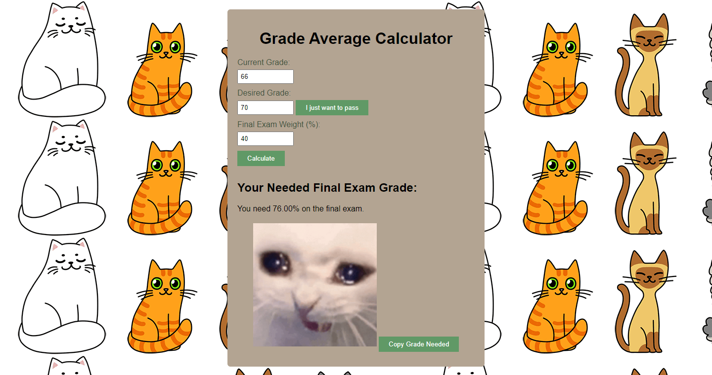

# GradeCalculator
A Grade Calculator using HTML

# Features
* Add your current grade, your desired grade and then the weight of the final exam
* Click on the "I just want to pass" To have "50%" as a default desired grade
* Click on the 'Copy Grade" button to copy the needed grade into your clipboard
